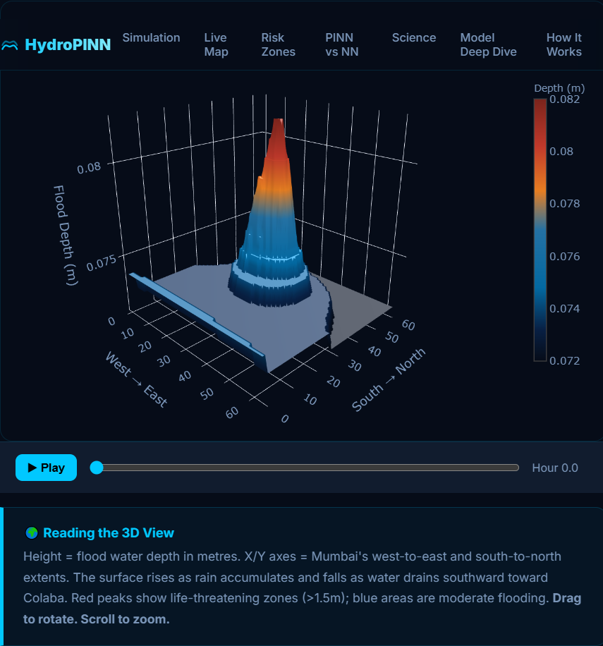

# HydroPINN — Mumbai 2005 Flood Prediction AI

A physics-informed flood forecasting system for the 26 July 2005 Mumbai disaster. HydroPINN combines a deep neural model with the Shallow Water Equations to predict flood depth, risk zones, and safe evacuation routes across a real-world urban terrain.

## Live Demo

🌊 [View the live app](https://hydropinn.netlify.app)




## Overview

HydroPINN is built to demonstrate how physics-informed neural networks can improve flood modeling by enforcing hydrodynamic conservation laws.

Key capabilities:

- Accurate flood depth prediction over time
- Spatial flood-risk classification
- Real road evacuation routing using OSRM
- Scientific comparison of PINN vs. standard neural network
- Web-enabled visualization and interactive exploration

## Core strengths

- **Physics-informed modeling** — PINN enforces the Shallow Water Equations to improve physical realism and generalization.
- **Real-world Mumbai data** — uses real terrain and rainfall inputs to model a high-impact urban flood scenario.
- **Actionable evacuation routing** — integrates safe road routing for flooded areas, making the output practical for disaster response.

## Highlights

| Metric                   | PINN       | Plain NN | Result                                  |
| ------------------------ | ---------- | -------- | --------------------------------------- |
| Test R²                  | 0.9895     | 0.9903   | Tied                                    |
| MAE                      | 0.037 m    | 0.031 m  | Comparable accuracy                     |
| Mass conservation error  | **0.0066** | 2.2042   | PINN is far more physically consistent  |
| Peak flood depth realism | 2.60 m     | lower    | PINN better matches observed hydraulics |

## Features

- **Physics-informed flood simulation** using the Shallow Water Equations
- **Risk zoning** for safe, moderate, high, and danger areas
- **Evacuation route planning** on real street networks
- **Comparative benchmarking** between PINN and plain NN models
- **Interactive dashboard** and export-ready web visualization

## Technical approach

HydroPINN predicts water depth `h` and velocity components `u, v` from
terrain, rainfall, and spatio-temporal inputs.

Model details:

- Input: `[x, y, t, z(terrain), R(rainfall)]`
- Architecture: 6 layers × 128 neurons, `tanh` activation, 10% dropout
- Outputs: `h` (via `softplus` to ensure non-negative depth), `u`, `v`
- Loss: `5.0 × L_data + 0.05 × L_pde + 0.005 × L_bc`
- Training: data-only warmup → combined PINN training → L-BFGS refinement

## Physics formulation

The network enforces the Shallow Water Equations through differentiable PyTorch residuals:

- Continuity: `∂h/∂t + ∂(hu)/∂x + ∂(hv)/∂y = R`
- x-momentum: `∂(hu)/∂t + ∂(hu² + ½ g h²)/∂x = −g h ∂z/∂x`
- y-momentum: `∂(hv)/∂t + ∂(hv² + ½ g h²)/∂y = −g h ∂z/∂y`

## Project structure

```text
HydroPINN/
├── model/          # PINN architecture, physics loss, training
├── data/           # terrain and rainfall generation
├── inference/      # prediction, risk zones, uncertainty
├── routing/        # evacuation routing over roads
├── comparison/     # PINN vs plain NN benchmarks
├── dashboard/      # Streamlit analysis app
└── webapp/         # web export and visualization tools
    └── static/     # deployable app assets
```

## Quick start

### Install dependencies

```bash
pip install torch numpy scipy matplotlib plotly streamlit networkx scikit-learn tqdm folium flask flask-cors
```

### Generate data

```bash
python data/terrain/generate_dem.py
python data/rainfall/generate_rainfall.py
```

### Train the model

```bash
python -c "from model.train import train; train(adam_epochs=4000, lbfgs_steps=500, lambda_data=5.0, lambda_pde=0.05, lambda_bc=0.005)"
```

### Run inference

```bash
python inference/predict.py
python inference/risk_zones.py
python inference/uncertainty.py
python routing/evacuate.py
python comparison/plain_nn.py
python comparison/compare.py
```

### Export for the web

```bash
python webapp/export_data.py
python webapp/analyze_model.py
python webapp/compare_detailed.py
cd webapp/static && python -m http.server 5000
```

Open `http://localhost:5000` to explore the generated visualizations.

## Tech stack

PyTorch · NumPy · SciPy · Folium · OSRM · Leaflet.js · Plotly.js · OpenStreetMap

## Why it matters

HydroPINN demonstrates how physics-aware machine learning can produce not only accurate flood forecasts, but also physically plausible and actionable outputs for urban resilience.

## 🤝 Connect & Collaborate

I'm Saniya, the developer behind this project. I’m passionate about deploying useful machine learning tools and welcome your engagement.

- Developer: **Saniya Randive**
- Contribute: Found a bug or have an idea for a feature? Please open an Issue or submit a Pull Request in this repository.
- Let's connect: [LinkedIn](https://www.linkedin.com/in/saniya-randive374628/)

## License

This repository is provided for research and demonstration purposes.
